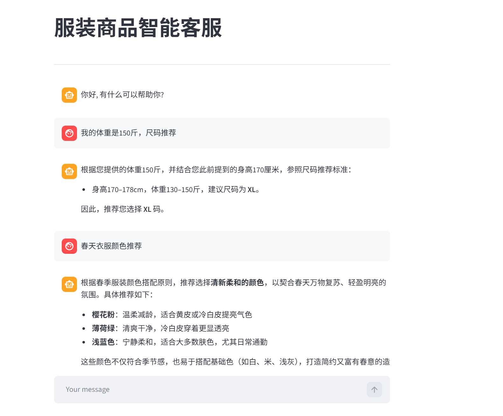

# fashion-rag-assistant
# 基于RAG的服装商品智能客服

**加载知识库web网页指令:** 
& D:/Anaconda3/envs/data_analysis/python.exe -m streamlit run app_file_uploader.py

**加载智能客服web网页指令:** 
& D:/Anaconda3/envs/data_analysis/python.exe -m streamlit run app_qa.py

## 核心模块
**app_file_upload.py:** 知识库更新主程序
**app_qa.py:** 项目主程序, 启动对话web页面
**config_data.py:** 配置文件
**file_history_store.py:** 长期会话记忆存储服务
**knowledge_base.py:** 知识库更新服务
**rag.py:** rag核心服务
**vector_stores.py:** 向量存储服务

## 成果展示
